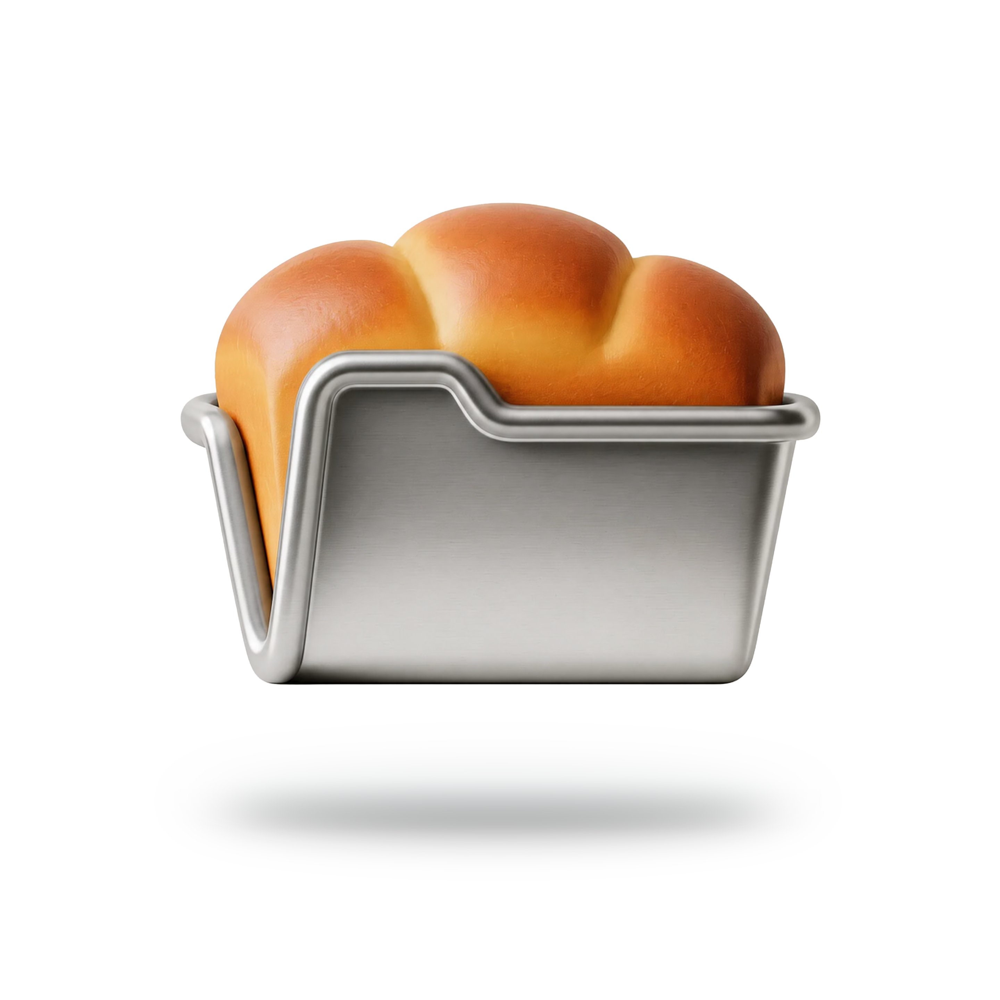

<p align="center">
  
</p>

<p align="center">
  <code>cook</code> CLI
</p>

---

`cook` is a TypeScript CLI for scaffolding directories and files from lightweight `.rcp` recipes. It is designed to be fast for one-off filesystem work, but reusable enough to become part of a real team workflow.

The local product spec lives at `docs/cook-spec.md`. That directory is intentionally gitignored, so the checked-in README serves as the public-facing guide for the repository.

## Features

**Describe once, recreate anywhere**  
Instead of manually creating the same folders and starter files over and over, Cook lets you describe the shape of a project in a small text file and apply it wherever you need it. It works just as well for codebases, writing workspaces, research folders, scratch projects, and team templates.

**Simple, clear templating language**  
Cook’s template format is built to be simple enough to read at a glance. You describe folders with indentation, attach file contents only where needed, and keep the whole thing easy to review in the terminal or in Git.

**One template, many possibilities**  
You can turn a single template into many different outputs by filling in placeholders like project names, package names, or environment labels. That makes it easy to reuse the same starting point for every new app, workspace, client project, or experiment without copying and editing files by hand.

**Repeat structures, not keystrokes**  
Cook can expand ranges and lists for you, so one line can create a whole set of related folders or files. This is especially useful for monorepos, repeated content pipelines, test fixtures, or any setup where you need the same pattern more than once.

**Cook where you work**  
Cook can run saved templates, local files, piped stdin input, or short inline expressions you type directly into the shell. That means it fits both long-lived reusable workflows and fast one-off moments when you just want to scaffold something immediately.

**Your personal scaffolding library**  
You can save templates, list them, show them, edit them, validate them, and reuse them across projects. Over time, Cook becomes a lightweight toolkit of your own proven project starters instead of a pile of copied folders.

**Capture existing patterns**  
If you already have a good structure on disk, `cook clone` can turn it into a template instead of making you rewrite it manually. That makes it easy to capture a working layout, share it with others, and standardize how new projects get started.

**Plays well with others**
Cook is designed for people who already live in the command line. It works with editors, pipes, files, arguments, and shell scripting conventions, so it adds power without forcing you into a separate app or a heavy framework-specific generator.

## Requirements

- Node.js 20 or newer
- pnpm 10 or newer
- A POSIX-like shell for the examples in this README

## Installation

`cook-cli` is set up for source-based use today.

```bash
git clone https://github.com/avanavana/cook-cli.git
cd cook-cli
pnpm install
pnpm build
pnpm link --global
```

After linking, the `cook` binary is available globally:

```bash
cook --help
```

For local development without a global link, you can also run:

```bash
pnpm exec cook --help
```

## Usage

### Command summary

```text
cook <recipe> [args...] [options]
cook taste <recipe> [args...] [options]
cook add <name> [source]
cook clone <source-path> <recipe-name> [options]
cook list
cook show <name>
cook edit <name>
cook validate <recipe> [args...] [options]
cook raw
cook -i
```

### Global concepts

#### Recipe resolution

When you run `cook <recipe>` or `cook taste <recipe>`, the first argument is resolved in this order:

1. `-` means read the recipe itself from stdin.
2. If the value contains whitespace and is not an existing saved recipe or filesystem path, it is treated as an inline recipe expression.
3. If it contains a `/`, starts with `.`, starts with `~`, or ends with `.rcp`, it is treated as a path.
4. Otherwise it is resolved as `~/.cook/recipes/<recipe>.rcp`.

#### Variable binding

Unbound variables are collected in first-appearance order across the recipe and then resolved from:

1. `--variable name=value`
2. `--var name=value`
3. `--variable name@path`
4. `--variable name@-`
5. Remaining positional arguments

#### Conflict flags

- `--force` allows overwriting existing files.
- `--no-clobber` skips files that already exist.
- `--merge` currently behaves like non-clobber mode and creates only missing entries without replacing existing file content.

### `cook`

Apply a recipe and write the planned filesystem changes to disk.

```bash
cook <recipe> [args...] [options]
```

Arguments:

- `<recipe>`: saved recipe name, `.rcp` path, `-`, or inline recipe expression
- `[args...]`: positional values for any remaining unbound variables

Options:

- `-o, --out <path>`: destination parent directory
- `--force`: overwrite files without prompting
- `--no-clobber`: skip files that already exist
- `--merge`: create missing entries but never overwrite content
- `--variable <name=value>`: bind a variable explicitly or load it from `name@path` / `name@-`
- `--var <name=value>`: alias for `--variable`

### `cook taste`

Preview a recipe without writing to disk.

```bash
cook taste <recipe> [args...] [options]
```

Arguments:

- `<recipe>`: saved recipe name, `.rcp` path, `-`, or inline recipe expression
- `[args...]`: positional values for any remaining unbound variables

Options:

- `-o, --out <path>`: destination parent directory used for conflict checks
- `--force`: preview the plan as if overwrites are allowed
- `--no-clobber`: preview skip behavior for existing files
- `--merge`: preview merge behavior for existing files
- `--variable <name=value>`: bind a variable explicitly or load it from `name@path` / `name@-`
- `--var <name=value>`: alias for `--variable`

Output includes:

- rendered tree
- resolved variable bindings
- file creation or overwrite status
- conflict locations when the destination already contains incompatible paths

### `cook add`

Save a recipe to `~/.cook/recipes/<name>.rcp`.

```bash
cook add <name> [source]
```

Arguments:

- `<name>`: saved recipe name
- `[source]`: recipe path, inline recipe expression, or omit it and pipe the recipe via stdin

Behavior:

- existing recipe files can be imported directly
- inline recipe expressions are normalized into standard multi-line `.rcp` format before they are saved
- reserved names such as `add`, `clone`, `list`, `raw`, `taste`, and `validate` are rejected

### `cook clone`

Clone an existing directory tree into a saved recipe.

```bash
cook clone <source-path> <recipe-name> [options]
```

Arguments:

- `<source-path>`: directory to inspect
- `<recipe-name>`: saved recipe name under `~/.cook/recipes`

Options:

- `--content`: include file bodies in the generated recipe

Defaults:

- `.DS_Store`, `node_modules`, and `.git` are ignored
- structure and empty files are cloned by default
- file contents are cloned only when `--content` is present

### `cook list`

List all saved recipes in `~/.cook/recipes`.

```bash
cook list
```

### `cook show`

Print a saved recipe to stdout.

```bash
cook show <name>
```

### `cook edit`

Open a saved recipe in your configured editor.

```bash
cook edit <name>
```

Editor resolution order:

1. `COOK_EDITOR`
2. `editor` in `~/.cook/config.toml`
3. `EDITOR`
4. `vi`

### `cook validate`

Validate a recipe and print a JSON summary of the resolved files and variables.

```bash
cook validate <recipe> [args...] [options]
```

Arguments:

- `<recipe>`: saved recipe name, `.rcp` path, `-`, or inline recipe expression
- `[args...]`: positional values for any remaining unbound variables

Options:

- `--variable <name=value>`: bind a variable explicitly or load it from `name@path` / `name@-`
- `--var <name=value>`: alias for `--variable`

### `cook raw` / `cook -i`

Reserved for the future interactive authoring flow built with Ink.

```bash
cook raw
cook -i
```

Current behavior:

- the command exists
- it is intentionally routed separately from the rest of the CLI architecture
- it currently exits with a not-yet-implemented message while the interactive flow is still under construction

## Examples

### Apply a saved recipe

```bash
cook web-app my-app -o ~/Code
```

### Preview before writing

```bash
cook taste web-app my-app -o ~/Code
```

### Apply a recipe from a path

```bash
cook ./recipes/web-app.rcp --variable project=my-app -o ~/Code
```

### Pipe the recipe itself through stdin

```bash
cat quick.rcp | cook - --variable project=draft-project -o ~/Desktop
```

### Bind a variable from a file

```bash
cook web-app --variable project@./project-name.txt -o ~/Code
```

### Bind a variable from stdin

```bash
printf 'my-app' | cook web-app --variable project@- -o ~/Code
```

### Use positional variables

```bash
cook workspace my-monorepo dashboard
```

### Use an inline recipe expression

```bash
cook 'project / src README.md' -o ~/Desktop
```

This creates:

```text
project/
  src/
  README.md
```

### Save an inline recipe expression as a recipe

```bash
cook add scratch 'project / notes todos.md'
```

### Clone a directory into a recipe

```bash
cook clone ./existing-project imported-project
```

## Recipes

### `.rcp` structure

An `.rcp` file has two logical sections:

1. a contiguous structure outline at the top of the file
2. zero or more file content blocks after the first blank line

Structure rules:

- the outline starts on line 1
- blank lines are not allowed inside the outline
- tabs are invalid
- indentation defines parent-child relationships

Example:

````text
{{project}}
  src
    app
    components
    lib
  public
  README.md
  package.json
````

### Variables

Use `{{name}}` everywhere:

- in node names
- in file content block headers
- in file bodies

Example:

````text
{{project}}
  README.md

README.md
---
# {{project}}
Created by Cook.
````

### Structural expansions

Supported V1 expansion forms:

- `{{0..4}}`
- `{{0..10..2}}`
- `{{a..d}}`
- `{{api,web,docs}}`

Example:

````text
packages
  {{api,web,docs}}
    src
    README.md
````

If you only need a few one-off entries, writing them out directly is usually clearer. Expansions become useful when the same subtree or naming pattern needs to repeat across multiple items.

### File content blocks

Each content block uses:

1. a file path header
2. a line containing exactly `---`
3. a raw body

Example:

````text
src
  main.ts

src/main.ts
---
console.log('Hello from Cook');
````

### Inline recipe expressions

Inline recipe expressions are intentionally small and only describe structure. They do not support file bodies.

Control tokens:

- `/`: descend into the previously created directory
- `..`: move back up one level

Quoted names with spaces are supported:

```bash
cook '"My Project" / "reference docs" README.md'
```

This creates:

```text
My Project/
  reference docs/
  README.md
```

### Saved recipe location

By default, Cook stores its local application data under `~/.cook`:

```text
~/.cook/
  recipes/
  config.toml
  history/
  cache/
```

## Development

Useful local commands:

```bash
pnpm install
pnpm check
pnpm test
pnpm lint
pnpm build
```

Branching and release workflow:

- day-to-day work should start from `dev`
- feature work should use conventional branch names such as `feat/parser-collisions` or `fix/clone-empty-files`
- pull requests should target `dev`
- releases happen by merging `dev` into `main`
- pushes to `main` trigger `semantic-release`

See [CONTRIBUTING.md](./CONTRIBUTING.md) for the full workflow.
